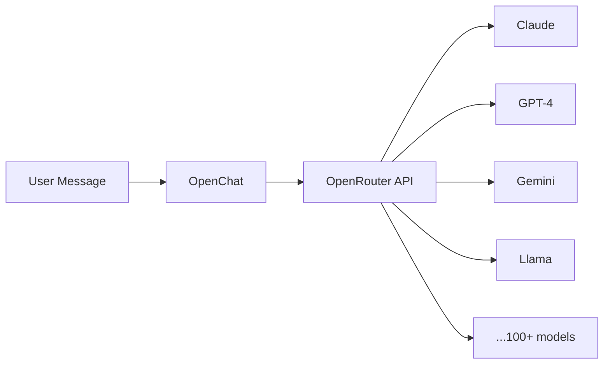
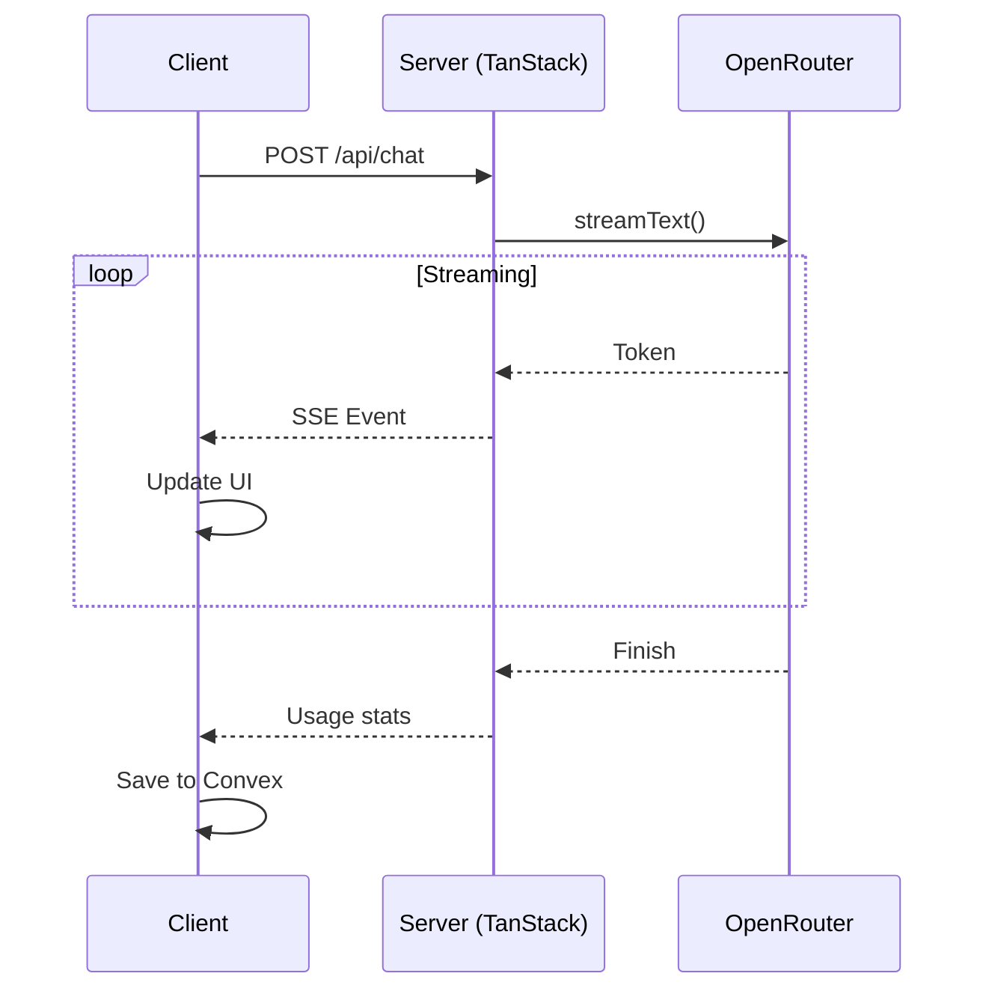

# AI Models & Chat

OpenChat uses **OpenRouter** as a unified gateway to access 100+ AI models from providers like OpenAI, Anthropic, Google, Meta, and more.

## Overview



OpenChat supports two modes for AI access:

| Mode | Description | Cost |
|------|-------------|------|
| **OSSChat Cloud** | Uses server's OpenRouter key | Free (10¢/day limit) |
| **BYOK** | Bring Your Own Key | Your OpenRouter credits |

## Dual Provider System

### OSSChat Cloud (Default)

The free tier uses the server's OpenRouter API key with daily limits:

```typescript
// Automatically used when no personal key is set
const provider = "osschat";
const apiKey = process.env.OPENROUTER_API_KEY; // Server's key
```

- **Daily limit**: ~10¢ worth of usage
- **Resets**: Daily at midnight UTC
- **Models**: All OpenRouter models available

### BYOK (Bring Your Own Key)

Users can connect their own OpenRouter account for unlimited access:

```typescript
// User's personal API key
const provider = "openrouter";
const apiKey = userStore.openrouterApiKey; // User's key
```

- **No limits**: Uses your own OpenRouter credits
- **All models**: Including premium models
- **Privacy**: API key stored locally (encrypted if saved to Convex)

## Connecting OpenRouter (BYOK)

<Steps>
  <Step title="Open Settings">
    Click your profile in the sidebar, then click **Settings**.
  </Step>
  
  <Step title="Go to Providers Tab">
    Select the **Providers** tab to see connection options.
  </Step>
  
  <Step title="Connect OpenRouter">
    Click **Connect OpenRouter**. You'll be redirected to OpenRouter to authorize.
    
    <Info>
      OpenChat uses OAuth PKCE for secure key exchange. Your key is never exposed in URLs.
    </Info>
  </Step>
  
  <Step title="Authorize">
    On OpenRouter, authorize the application. You'll be redirected back to OpenChat.
  </Step>
  
  <Step title="Start Using">
    Your models are now available! The provider switches to "Personal OpenRouter" automatically.
  </Step>
</Steps>

## Model Selection

### Using the Model Selector

Click the model name in the chat input to open the model selector:

- **Search**: Type to filter models
- **Favorites**: Star models for quick access
- **Details**: See context window, pricing, capabilities

### Model Capabilities

Models vary in their capabilities:

| Capability | Description | Example Models |
|------------|-------------|----------------|
| **Reasoning** | Extended thinking for complex tasks | Claude 3.5, o1, DeepSeek R1 |
| **Vision** | Process images | Claude 3.5, GPT-4o, Gemini |
| **Long Context** | Large context windows (100K+) | Claude 3.5, Gemini Pro |
| **Fast** | Low latency responses | GPT-4o-mini, Claude Haiku |

### Reasoning Mode

For supported models, enable reasoning mode to see the AI's thinking process:

```typescript
// Configure reasoning effort
const reasoningEffort = "medium"; // none, low, medium, high

// Sent to OpenRouter
providerOptions: {
  openrouter: {
    reasoning: {
      effort: reasoningEffort
    }
  }
}
```

Reasoning appears in a collapsible "Chain of Thought" section above the response.

## Chat API

### Endpoint

```
POST /api/chat
```

### Request Body

```typescript
{
  messages: UIMessage[],      // Conversation history
  model: string,              // e.g., "anthropic/claude-3.5-sonnet"
  provider: "osschat" | "openrouter",
  apiKey?: string,            // Required for "openrouter" provider
  enableWebSearch?: boolean,  // Enable web search tool
  reasoningEffort?: "none" | "low" | "medium" | "high",
  maxSteps?: number           // Max tool call iterations (default: 5)
}
```

### Response

Returns a Server-Sent Events stream compatible with AI SDK 5's `useChat` hook:

```typescript
// Stream events
data: {"type":"text","content":"Hello"}
data: {"type":"text","content":" there!"}
data: {"type":"finish","usage":{"promptTokens":10,"completionTokens":5}}
```

### Example

```typescript
import { useChat } from "ai/react";

function ChatComponent() {
  const { messages, input, handleInputChange, handleSubmit } = useChat({
    api: "/api/chat",
    body: {
      model: "anthropic/claude-3.5-sonnet",
      provider: "osschat",
    },
  });
  
  return (
    <form onSubmit={handleSubmit}>
      <input value={input} onChange={handleInputChange} />
      <button type="submit">Send</button>
    </form>
  );
}
```

## Streaming Architecture

OpenChat uses AI SDK 5 for streaming:



### Cancellation Support

Users can cancel in-progress responses:

```typescript
// Client
const abortController = new AbortController();
fetch("/api/chat", { signal: abortController.signal });

// To cancel
abortController.abort();

// Server
const abortSignal = request.signal;
streamText({ model, messages, abortSignal });
```

## Web Search

OpenChat can search the web for current information:

```typescript
// Enable web search
const response = await fetch("/api/chat", {
  method: "POST",
  body: JSON.stringify({
    messages,
    model: "anthropic/claude-3.5-sonnet",
    enableWebSearch: true,  // Enable
    maxSteps: 5             // Allow tool iterations
  })
});
```

Web search uses the Valyu AI SDK and requires `VALYU_API_KEY` to be configured.

## Token Usage & Cost Tracking

### Usage Display

Token usage is tracked and displayed per message:

```typescript
// Response includes usage metadata
{
  inputTokens: 1234,
  outputTokens: 567,
  totalTokens: 1801
}
```

### Cost Calculation

For OSSChat Cloud, costs are tracked against the daily limit:

```typescript
// Provider store tracks usage
const { dailyUsageCents, dailyLimitCents } = useProviderStore();

// Display remaining budget
const remaining = dailyLimitCents - dailyUsageCents; // e.g., 7¢ remaining
```

## File Attachments

Upload images and documents to include in messages:

```typescript
// Generate upload URL
const uploadUrl = await convex.mutation(api.files.generateUploadUrl, {
  userId,
  chatId
});

// Upload file
await fetch(uploadUrl, {
  method: "POST",
  body: file
});

// Save metadata
const { fileId, url } = await convex.mutation(api.files.saveFileMetadata, {
  userId,
  chatId,
  storageId,
  filename: file.name,
  contentType: file.type,
  size: file.size
});
```

### Limits

| Limit | Value |
|-------|-------|
| Max file size | 10 MB |
| Files per user | 150 total |
| Supported types | Images (jpg, png, gif, webp), PDF |

## Prompt Templates

Create custom slash commands for frequently used prompts:

```typescript
// Create template
await convex.mutation(api.promptTemplates.create, {
  name: "Code Review",
  command: "/review",
  template: "Review this code for bugs and improvements:\n\n$ARGUMENTS",
  category: "coding"
});

// Use in chat
/review function add(a, b) { return a + b; }
```

### Template Variables

| Variable | Description |
|----------|-------------|
| `$ARGUMENTS` | Everything after the command |
| `$1`, `$2`, ... | Positional arguments |

## Configuration

### Environment Variables

```bash
# Server-side
OPENROUTER_API_KEY=sk-or-v1-...  # For OSSChat Cloud
VALYU_API_KEY=...                 # For web search

# Client-side (if needed)
# None - API keys should never be on client
```

### Rate Limits

The chat API is rate-limited to prevent abuse:

| Operation | Rate | Burst |
|-----------|------|-------|
| Message send | 30/min | 10 |
| Stream upsert | 200/min | 50 |

## Troubleshooting

<AccordionGroup>
  <Accordion title="Model not responding">
    Check:
    1. Model is available (some are intermittently down)
    2. API key is valid (try regenerating)
    3. You have credits (for BYOK) or daily budget (for OSSChat)
  </Accordion>
  
  <Accordion title="Streaming stops mid-response">
    This can happen if:
    1. Network connection drops
    2. Model reaches max tokens
    3. Rate limit exceeded
    
    Try sending a shorter message or switching models.
  </Accordion>
  
  <Accordion title="Web search not working">
    Verify:
    1. `VALYU_API_KEY` is set on the server
    2. `enableWebSearch: true` in request
    3. Model supports tool use
  </Accordion>
  
  <Accordion title="Daily limit reached">
    For OSSChat Cloud, the 10¢ daily limit resets at midnight UTC. Options:
    1. Wait for reset
    2. Connect your own OpenRouter key (BYOK)
  </Accordion>
</AccordionGroup>

## Next Steps

<CardGroup cols={2}>
  <Card title="Self-Hosting" icon="server" href="/self-hosting/docker">
    Deploy with your own API keys
  </Card>
  <Card title="Contributing" icon="code" href="/guides/contributing">
    Add new model integrations
  </Card>
</CardGroup>
