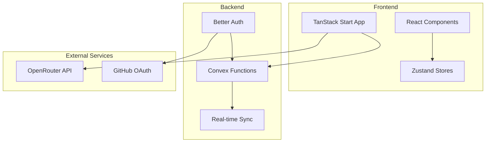
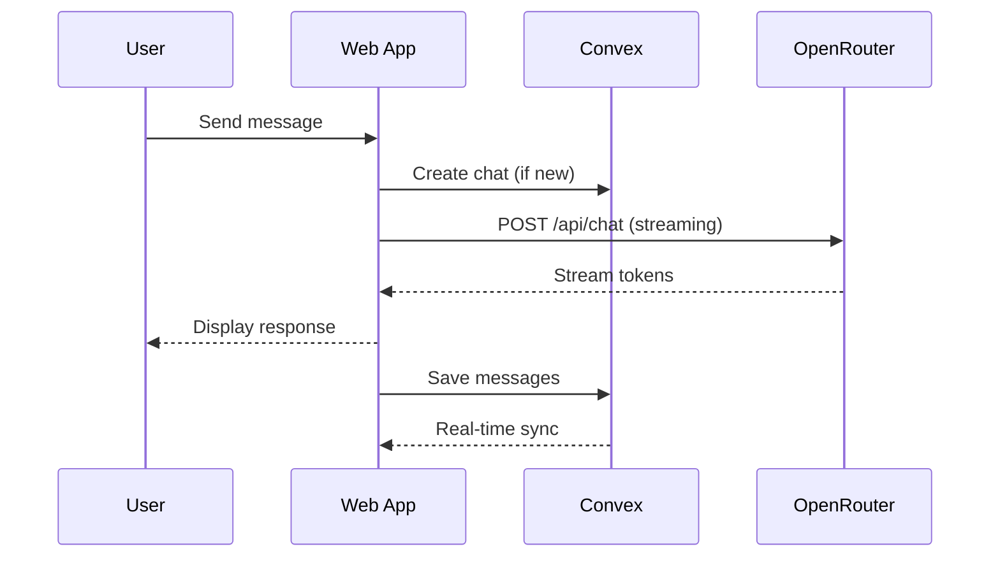
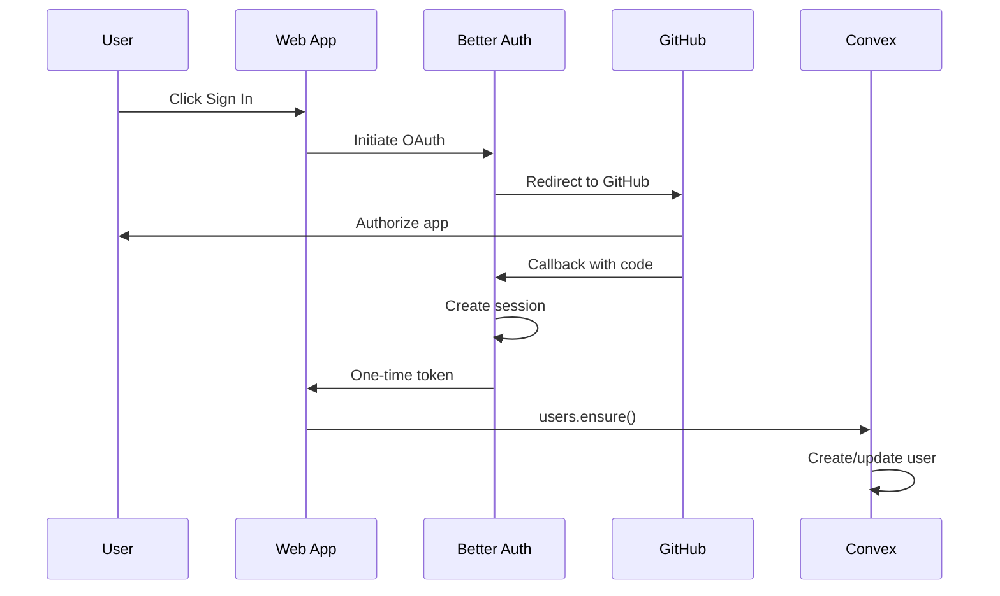

# Architecture Overview

OpenChat uses a modern, three-tier architecture designed for real-time collaboration, streaming AI responses, and seamless cross-device sync.

## System Overview



## Core Components

<AccordionGroup>
  <Accordion title="Frontend: TanStack Start" icon="browser">
    The frontend is built with **TanStack Start**, a full-stack React framework powered by Vite. It provides:
    
    - **File-based routing** via TanStack Router
    - **Server-side rendering** for fast initial loads
    - **Type-safe navigation** with automatic route inference
    
    Key directories:
    - `apps/web/src/routes/` - Page components and API routes
    - `apps/web/src/components/` - Reusable UI components
    - `apps/web/src/stores/` - Zustand state management
    - `apps/web/src/lib/` - Utilities and clients
  </Accordion>
  
  <Accordion title="Backend: Convex" icon="database">
    **Convex** provides the real-time backend with:
    
    - **Reactive queries** - UI updates automatically when data changes
    - **Transactional mutations** - Atomic, consistent writes
    - **Scheduled functions** - Background jobs and cron tasks
    - **File storage** - Built-in blob storage for attachments
    
    Key files:
    - `apps/server/convex/schema.ts` - Database schema
    - `apps/server/convex/chats.ts` - Chat CRUD operations
    - `apps/server/convex/messages.ts` - Message handling
    - `apps/server/convex/users.ts` - User management
  </Accordion>
  
  <Accordion title="Authentication: Better Auth" icon="lock">
    **Better Auth** handles authentication with:
    
    - **GitHub OAuth** for sign-in
    - **Cross-domain sessions** between frontend and Convex
    - **JWT tokens** for authenticated Convex queries
    
    The auth flow syncs users to Convex via the `users.ensure` mutation.
  </Accordion>
  
  <Accordion title="AI Layer: OpenRouter" icon="robot">
    **OpenRouter** provides unified access to AI models:
    
    - **100+ models** from OpenAI, Anthropic, Google, Meta, etc.
    - **Streaming responses** for real-time output
    - **Usage tracking** for cost management
    
    Supports two modes:
    - **OSSChat Cloud** - Free tier using server's API key
    - **BYOK** - Bring Your Own Key for unlimited access
  </Accordion>
</AccordionGroup>

## Data Flow

### Chat Message Flow



<Steps>
  <Step title="User Input">
    User types a message in the `PromptInput` component.
  </Step>
  
  <Step title="Chat Creation">
    If it's a new chat, `usePersistentChat` calls the `chats.create` mutation to create a chat document in Convex.
  </Step>
  
  <Step title="AI Request">
    The message is sent to `/api/chat` (server route), which forwards to OpenRouter with the selected model.
  </Step>
  
  <Step title="Streaming Response">
    OpenRouter streams tokens back via Server-Sent Events. The UI updates in real-time as tokens arrive.
  </Step>
  
  <Step title="Persistence">
    On completion, both user and assistant messages are saved to Convex via `messages.send`.
  </Step>
  
  <Step title="Real-time Sync">
    Convex's reactive queries automatically update the sidebar and any other connected clients.
  </Step>
</Steps>

### Authentication Flow



## Database Schema

OpenChat uses 8 main tables in Convex:

| Table | Purpose | Key Fields |
|-------|---------|------------|
| `users` | Auth data, ban status | `externalId`, `email`, `banned` |
| `profiles` | User preferences | `name`, `avatarUrl`, `favoriteModels` |
| `chats` | Conversations | `userId`, `title`, `messageCount` |
| `messages` | Chat messages | `chatId`, `role`, `content`, `reasoning` |
| `fileUploads` | Attachments | `storageId`, `filename`, `contentType` |
| `promptTemplates` | Custom prompts | `command`, `template`, `category` |
| `chatReadStatus` | Unread tracking | `userId`, `chatId`, `lastReadAt` |
| `dbStats` | Aggregated stats | `key`, `value` |

## State Management

The frontend uses **Zustand** for client-side state with several specialized stores:

| Store | Purpose |
|-------|---------|
| `model.ts` | Selected model, reasoning effort, favorites |
| `provider.ts` | Active provider (osschat/openrouter), usage limits |
| `openrouter.ts` | BYOK API key management |
| `stream.ts` | Streaming state machine |
| `ui.ts` | Sidebar, command palette state |

All stores use the `persist` middleware for localStorage persistence and `devtools` for debugging.

## Key Patterns

### Optimistic Updates

Convex queries are reactive, but OpenChat also uses optimistic updates for instant feedback:

```typescript
// Message appears immediately in UI
const optimisticMessage = { id: 'temp', content: message };
setMessages([...messages, optimisticMessage]);

// Then persisted to Convex
await sendMessage({ chatId, content: message });
```

### Rate Limiting

Convex mutations are rate-limited using `@convex-dev/rate-limiter`:

| Operation | Rate | Burst |
|-----------|------|-------|
| Chat create | 20/min | 5 |
| Message send | 30/min | 10 |
| File upload | 10/min | 3 |

### Error Handling

Errors are displayed inline as messages (like T3.chat), not as toast notifications:

```typescript
// Errors saved as messages with type 'error'
await messages.send({
  chatId,
  role: 'assistant',
  content: error.message,
  messageType: 'error'
});
```

## Directory Structure

```
openchat/
├── apps/
│   ├── web/                    # Frontend (TanStack Start)
│   │   ├── src/
│   │   │   ├── routes/         # Pages and API routes
│   │   │   │   ├── __root.tsx  # Root layout
│   │   │   │   ├── index.tsx   # Home page
│   │   │   │   ├── c/$chatId.tsx  # Chat page
│   │   │   │   └── api/chat.ts # Chat API route
│   │   │   ├── components/     # React components
│   │   │   │   ├── chat-interface.tsx
│   │   │   │   ├── app-sidebar.tsx
│   │   │   │   └── ui/         # shadcn/ui primitives
│   │   │   ├── stores/         # Zustand stores
│   │   │   ├── hooks/          # Custom hooks
│   │   │   ├── lib/            # Utilities
│   │   │   └── providers/      # React context providers
│   │   └── .env.local          # Environment variables
│   └── server/                 # Backend (Convex)
│       └── convex/
│           ├── schema.ts       # Database schema
│           ├── auth.ts         # Better Auth config
│           ├── chats.ts        # Chat operations
│           ├── messages.ts     # Message operations
│           ├── users.ts        # User operations
│           ├── streaming.ts    # LLM streaming
│           └── http.ts         # HTTP endpoints
├── docs-site/                  # Documentation (Mintlify)
└── docs/                       # Internal docs
```

## Next Steps

<CardGroup cols={2}>
  <Card title="Authentication" icon="lock" href="/guides/authentication">
    Learn how the auth system works
  </Card>
  <Card title="AI Models" icon="robot" href="/guides/ai-models">
    Understand model selection and streaming
  </Card>
</CardGroup>
