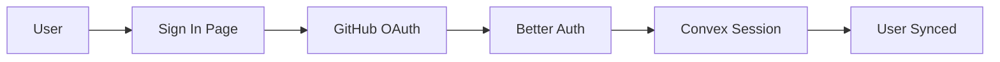

# Authentication

OpenChat uses **Better Auth** with GitHub OAuth for user authentication, integrated with Convex for real-time user data sync.

## Overview



The authentication flow involves three key components:

1. **Better Auth** - Handles OAuth and session management
2. **GitHub** - Identity provider for user authentication  
3. **Convex** - Stores user data and provides real-time sync

## Authentication Flow

<Steps>
  <Step title="Initiate Sign-In">
    User clicks "Continue with GitHub" on the sign-in page. This calls:
    
    ```typescript
    import { signInWithGitHub } from "@/lib/auth-client";
    
    await signInWithGitHub("/"); // Redirect to home after auth
    ```
  </Step>
  
  <Step title="GitHub Authorization">
    User is redirected to GitHub to authorize the application. GitHub shows:
    - App name and permissions requested
    - Option to grant or deny access
  </Step>
  
  <Step title="Callback Processing">
    GitHub redirects back to Convex with an authorization code:
    ```
    https://your-convex-site.convex.site/api/auth/callback/github?code=xxx
    ```
    
    Better Auth exchanges the code for user info and creates a session.
  </Step>
  
  <Step title="Session Establishment">
    The frontend receives a one-time token (OTT) and exchanges it for a session:
    
    ```typescript
    // Automatic in StableAuthProvider
    await authClient.crossDomain.oneTimeToken.verify({ token: ott });
    ```
  </Step>
  
  <Step title="User Sync to Convex">
    The `UserSyncProvider` calls `users.ensure` to sync the user to Convex:
    
    ```typescript
    await convex.mutation(api.users.ensure, {
      externalId: user.id,
      email: user.email,
      name: user.name,
      avatarUrl: user.image
    });
    ```
  </Step>
</Steps>

## Key Components

### Auth Client (`auth-client.tsx`)

The Better Auth client is configured with cross-domain support:

```typescript
import { createAuthClient } from "better-auth/react";
import { convexClient, crossDomainClient } from "@convex-dev/better-auth/client/plugins";

export const authClient = createAuthClient({
  baseURL: env.CONVEX_SITE_URL,
  plugins: [
    convexClient(),      // Convex JWT integration
    crossDomainClient({  // Cross-origin session handling
      storage: deduplicatingStorage,
    }),
  ],
});
```

### useAuth Hook

Access auth state anywhere in your app:

```typescript
import { useAuth } from "@/lib/auth-client";

function MyComponent() {
  const { user, isAuthenticated, loading } = useAuth();
  
  if (loading) return <Skeleton />;
  if (!isAuthenticated) return <SignInPrompt />;
  
  return <div>Welcome, {user.name}!</div>;
}
```

The hook provides:

| Property | Type | Description |
|----------|------|-------------|
| `user` | `SessionUser \| null` | Current user (id, email, name, image) |
| `session` | `Session \| null` | Session data (id, token) |
| `isAuthenticated` | `boolean` | Whether user is logged in |
| `loading` | `boolean` | Initial auth check in progress |
| `refetchSession` | `() => Promise<void>` | Manually refresh session |

### Provider Hierarchy

The app wraps components in auth providers:

```tsx
// providers/index.tsx
<StableAuthProvider>           {/* Better Auth session */}
  <ConvexProviderWithAuth>     {/* Authenticated Convex client */}
    <UserSyncProvider>         {/* Sync user to Convex */}
      {children}
    </UserSyncProvider>
  </ConvexProviderWithAuth>
</StableAuthProvider>
```

## Protected Routes

OpenChat uses component-level auth guards (not middleware):

```tsx
// routes/c/$chatId.tsx
function ChatPage() {
  const { isAuthenticated, loading } = useAuth();

  if (loading) {
    return <div className="flex h-full bg-background" />;
  }

  if (!isAuthenticated) {
    return (
      <div className="flex flex-col items-center justify-center gap-6">
        <h1>Sign in to continue</h1>
        <Link to="/auth/sign-in">
          <Button>Sign In</Button>
        </Link>
      </div>
    );
  }

  return <ChatInterface chatId={chatId} />;
}
```

Protected routes in OpenChat:
- `/` (home) - Shows landing page for guests, chat for authenticated
- `/c/:chatId` - Individual chat pages
- `/settings` - User settings

## Convex Integration

### User Schema

```typescript
// schema.ts
users: defineTable({
  externalId: v.string(),     // Better Auth user ID
  email: v.optional(v.string()),
  name: v.optional(v.string()),
  avatarUrl: v.optional(v.string()),
  banned: v.optional(v.boolean()),
  createdAt: v.number(),
  updatedAt: v.number(),
})
  .index("by_external_id", ["externalId"])
  .index("by_email", ["email"])
```

### User Sync Mutation

```typescript
// users.ts
export const ensure = mutation({
  args: {
    externalId: v.string(),
    email: v.optional(v.string()),
    name: v.optional(v.string()),
    avatarUrl: v.optional(v.string()),
  },
  handler: async (ctx, args) => {
    // Find existing user
    let user = await ctx.db
      .query("users")
      .withIndex("by_external_id", q => q.eq("externalId", args.externalId))
      .first();
    
    if (!user) {
      // Create new user
      const userId = await ctx.db.insert("users", {
        externalId: args.externalId,
        email: args.email,
        name: args.name,
        avatarUrl: args.avatarUrl,
        createdAt: Date.now(),
        updatedAt: Date.now(),
      });
      return { userId };
    }
    
    // Update existing user
    await ctx.db.patch(user._id, {
      email: args.email,
      name: args.name,
      avatarUrl: args.avatarUrl,
      updatedAt: Date.now(),
    });
    
    return { userId: user._id };
  },
});
```

## Configuration

### Environment Variables

```bash
# apps/web/.env.local

# GitHub OAuth
GITHUB_CLIENT_ID=your_client_id
GITHUB_CLIENT_SECRET=your_client_secret

# Auth secret (min 32 characters)
BETTER_AUTH_SECRET=your_random_secret

# Convex URLs
VITE_CONVEX_URL=https://your-project.convex.cloud
VITE_CONVEX_SITE_URL=https://your-project.convex.site
```

### GitHub OAuth Setup

<Steps>
  <Step title="Create OAuth App">
    Go to [GitHub Developer Settings](https://github.com/settings/developers) and click **New OAuth App**.
  </Step>
  
  <Step title="Configure URLs">
    | Field | Value |
    |-------|-------|
    | Application name | OpenChat |
    | Homepage URL | `https://your-domain.com` |
    | Authorization callback URL | `https://your-convex-site.convex.site/api/auth/callback/github` |
    
    <Warning>
      The callback URL must point to your **Convex site URL**, not your web app domain.
    </Warning>
  </Step>
  
  <Step title="Copy Credentials">
    Copy the **Client ID** and generate a **Client Secret**. Add them to your `.env.local`.
  </Step>
</Steps>

### Better Auth Server Config

```typescript
// apps/server/convex/auth.ts
import { convex } from "@convex-dev/better-auth";
import { betterAuth } from "better-auth";

export const auth = betterAuth({
  trustedOrigins: [
    "http://localhost:3000",
    "https://your-domain.com",
  ],
  socialProviders: {
    github: {
      clientId: process.env.GITHUB_CLIENT_ID!,
      clientSecret: process.env.GITHUB_CLIENT_SECRET!,
    },
  },
  plugins: [convex()],
});
```

## Sign Out

To sign out a user:

```typescript
import { signOut } from "@/lib/auth-client";

async function handleSignOut() {
  await signOut();
  // Redirects to /auth/sign-in automatically
}
```

## Troubleshooting

<AccordionGroup>
  <Accordion title="OAuth callback fails">
    Check that:
    1. Callback URL in GitHub matches exactly (no trailing slash)
    2. `VITE_CONVEX_SITE_URL` is correct in your env
    3. Convex is running and accessible
  </Accordion>
  
  <Accordion title="Session not persisting">
    The session is stored in localStorage and synced to a cookie. Check:
    1. Browser allows cookies/localStorage
    2. No browser extensions blocking storage
    3. `BETTER_AUTH_SECRET` is consistent across restarts
  </Accordion>
  
  <Accordion title="User not syncing to Convex">
    If `users.ensure` fails:
    1. Check Convex logs for errors
    2. Verify rate limits aren't exceeded
    3. Ensure auth is complete before sync (check `isAuthenticated`)
  </Accordion>
  
  <Accordion title="Infinite redirect loop">
    This can happen if:
    1. Callback URL misconfigured
    2. Session validation failing
    3. Cross-domain cookie issues (check `SameSite` settings)
  </Accordion>
</AccordionGroup>

## Security Considerations

<Warning>
  Never expose `BETTER_AUTH_SECRET` or `GITHUB_CLIENT_SECRET` to the client. These should only be in server-side environment variables.
</Warning>

- **Session tokens** are stored securely with `SameSite=Lax` cookies
- **JWT tokens** for Convex expire and are refreshed automatically
- **Rate limiting** prevents brute-force attacks on auth endpoints
- **HTTPS required** in production for secure cookie transmission

## Next Steps

<CardGroup cols={2}>
  <Card title="AI Models" icon="robot" href="/guides/ai-models">
    Learn about model selection and BYOK
  </Card>
  <Card title="Self-Hosting" icon="server" href="/self-hosting/docker">
    Deploy with your own auth configuration
  </Card>
</CardGroup>
