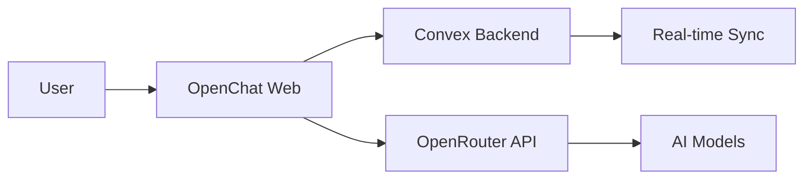

# Welcome to OpenChat

OpenChat is an **open-source AI chat workspace** that you can self-host or use via OpenChat Cloud. It provides a beautiful, real-time chat interface with access to hundreds of AI models through OpenRouter.

<CardGroup cols={2}>
  <Card title="Quickstart" icon="rocket" href="/quickstart">
    Get up and running with OpenChat in under 5 minutes
  </Card>
  <Card title="Architecture" icon="sitemap" href="/guides/architecture">
    Understand how OpenChat is built
  </Card>
  <Card title="Self-Hosting" icon="server" href="/self-hosting/docker">
    Deploy OpenChat on your own infrastructure
  </Card>
  <Card title="AI Models" icon="robot" href="/guides/ai-models">
    Learn about model selection and BYOK
  </Card>
</CardGroup>

## Why OpenChat?

<AccordionGroup>
  <Accordion title="100+ AI Models" icon="brain">
    Access Claude, GPT-4, Gemini, Llama, Mistral, and many more models through a single interface. OpenRouter handles the complexity of multiple providers.
  </Accordion>
  <Accordion title="Real-time Sync" icon="arrows-rotate">
    Built on Convex, OpenChat provides instant sync across devices. Your conversations are always up to date, with optimistic updates for a snappy feel.
  </Accordion>
  <Accordion title="Bring Your Own Key" icon="key">
    Use OpenChat Cloud's free tier, or bring your own OpenRouter API key for unlimited access to any model. Your key, your credits.
  </Accordion>
  <Accordion title="Open Source" icon="code-branch">
    Fully open source under AGPLv3. Inspect the code, contribute improvements, or self-host for complete control over your data.
  </Accordion>
</AccordionGroup>

## Key Features

| Feature | Description |
|---------|-------------|
| **Streaming Responses** | Watch AI responses appear in real-time with smooth streaming |
| **File Attachments** | Upload images and documents to include in your conversations |
| **Web Search** | Enable AI to search the web for current information |
| **Reasoning Mode** | See the AI's thinking process with extended reasoning models |
| **Prompt Templates** | Create custom slash commands for frequently used prompts |
| **Dark Mode** | Beautiful light and dark themes that respect your system preference |

## How It Works

1. **Sign in** with GitHub OAuth
2. **Start chatting** - messages are stored in Convex for real-time sync
3. **AI responds** via OpenRouter, streaming directly to your browser
4. **Access anywhere** - your chats sync across all your devices

## Tech Stack

OpenChat is built with modern, production-ready technologies:

- **Frontend**: [TanStack Start](https://tanstack.com/start) (Vite + TanStack Router)
- **Backend**: [Convex](https://convex.dev) for real-time database and functions
- **Auth**: [Better Auth](https://better-auth.com) with GitHub OAuth
- **AI**: [OpenRouter](https://openrouter.ai) for unified model access
- **Styling**: [Tailwind CSS v4](https://tailwindcss.com) + [shadcn/ui](https://ui.shadcn.com)

## Getting Help

<CardGroup cols={2}>
  <Card title="GitHub Discussions" icon="comments" href="https://github.com/tryosschat/openchat/discussions">
    Ask questions and share ideas
  </Card>
  <Card title="GitHub Issues" icon="bug" href="https://github.com/tryosschat/openchat/issues">
    Report bugs or request features
  </Card>
</CardGroup>

## License

OpenChat is licensed under the [GNU Affero General Public License v3](https://github.com/tryosschat/openchat/blob/main/LICENSE). This means you can use, modify, and distribute OpenChat, but any modifications must also be open source.
