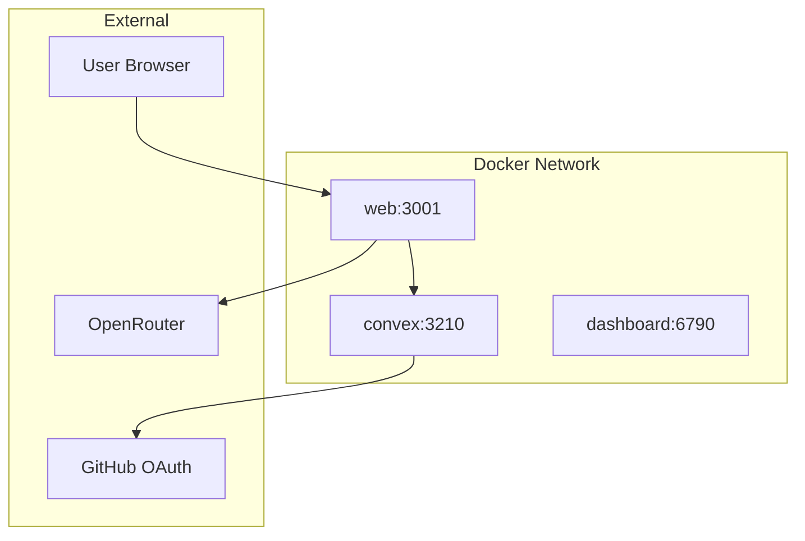

# Docker Deployment

Deploy OpenChat using Docker Compose for a self-contained, reproducible setup.

## Prerequisites

- Docker 24+
- Docker Compose plugin
- Valid credentials for GitHub OAuth and Convex

## Quick Start

<Steps>
  <Step title="Clone the repository">
    ```bash
    git clone https://github.com/tryosschat/openchat.git
    cd openchat
    ```
  </Step>
  
  <Step title="Configure environment">
    Copy and fill in the environment files:
    
    ```bash
    cp env.web.example apps/web/.env.local
    cp env.server.example apps/server/.env.local
    ```
    
    Minimum required variables:
    
    ```bash
    # apps/web/.env.local
    VITE_CONVEX_URL=http://convex:3210
    VITE_CONVEX_SITE_URL=http://localhost:3211
    GITHUB_CLIENT_ID=your_client_id
    GITHUB_CLIENT_SECRET=your_client_secret
    BETTER_AUTH_SECRET=your_32_char_secret
    OPENROUTER_API_KEY=sk-or-v1-...  # Optional for OSSChat Cloud
    ```
  </Step>
  
  <Step title="Build and run">
    ```bash
    docker compose up --build
    ```
    
    Services will be available at:
    - **Web app**: http://localhost:3001
    - **Convex**: http://localhost:3210
    - **Convex dashboard**: http://localhost:6790
  </Step>
</Steps>

## Container Architecture



| Service | Image | Ports | Purpose |
|---------|-------|-------|---------|
| `web` | `docker/web.Dockerfile` | 3001 | TanStack Start frontend |
| `convex` | `docker/convex.Dockerfile` | 3210, 6790 | Convex backend + dashboard |

## Configuration

### docker-compose.yml

```yaml
version: '3.8'

services:
  web:
    build:
      context: .
      dockerfile: docker/web.Dockerfile
    ports:
      - "3001:3001"
    environment:
      - VITE_CONVEX_URL=http://convex:3210
      - VITE_CONVEX_SITE_URL=http://localhost:3211
      - GITHUB_CLIENT_ID=${GITHUB_CLIENT_ID}
      - GITHUB_CLIENT_SECRET=${GITHUB_CLIENT_SECRET}
      - BETTER_AUTH_SECRET=${BETTER_AUTH_SECRET}
      - OPENROUTER_API_KEY=${OPENROUTER_API_KEY}
    depends_on:
      - convex
    networks:
      - openchat

  convex:
    build:
      context: .
      dockerfile: docker/convex.Dockerfile
    ports:
      - "3210:3210"
      - "6790:6790"
    volumes:
      - ./apps/server:/app/apps/server
    networks:
      - openchat

networks:
  openchat:
    driver: bridge
```

### Environment Variables

<Tabs>
  <Tab title="Required">
    | Variable | Description |
    |----------|-------------|
    | `GITHUB_CLIENT_ID` | GitHub OAuth app client ID |
    | `GITHUB_CLIENT_SECRET` | GitHub OAuth app secret |
    | `BETTER_AUTH_SECRET` | Session encryption key (32+ chars) |
    | `VITE_CONVEX_URL` | Internal Convex URL |
    | `VITE_CONVEX_SITE_URL` | Public Convex URL for auth callbacks |
  </Tab>
  <Tab title="Optional">
    | Variable | Description | Default |
    |----------|-------------|---------|
    | `OPENROUTER_API_KEY` | Server OpenRouter key for free tier | - |
    | `VALYU_API_KEY` | Web search API key | - |
    | `VITE_POSTHOG_KEY` | PostHog analytics key | - |
    | `VITE_POSTHOG_HOST` | PostHog host URL | - |
  </Tab>
</Tabs>

## Production Deployment

For production, you'll need to:

### 1. Use HTTPS

Place a reverse proxy (Nginx, Caddy, Traefik) in front:

```nginx
# nginx.conf
upstream web {
    server web:3001;
}

upstream convex {
    server convex:3210;
}

server {
    listen 443 ssl;
    server_name chat.yourdomain.com;
    
    ssl_certificate /etc/ssl/certs/fullchain.pem;
    ssl_certificate_key /etc/ssl/private/privkey.pem;
    
    location / {
        proxy_pass http://web;
        proxy_http_version 1.1;
        proxy_set_header Upgrade $http_upgrade;
        proxy_set_header Connection "upgrade";
    }
}

server {
    listen 443 ssl;
    server_name convex.yourdomain.com;
    
    location / {
        proxy_pass http://convex;
        proxy_http_version 1.1;
        proxy_set_header Upgrade $http_upgrade;
        proxy_set_header Connection "upgrade";
    }
}
```

### 2. Update OAuth Callback URLs

Update your GitHub OAuth app callback URL to use your production Convex domain:

```
https://convex.yourdomain.com/api/auth/callback/github
```

### 3. Update Environment Variables

```bash
VITE_CONVEX_URL=https://convex.yourdomain.com
VITE_CONVEX_SITE_URL=https://convex.yourdomain.com
```

### 4. Enable Persistent Storage

Add volumes for data persistence:

```yaml
convex:
  volumes:
    - convex-data:/data
    
volumes:
  convex-data:
```

## Commands

```bash
# Build and start
docker compose up --build

# Start in background
docker compose up -d

# View logs
docker compose logs -f

# Rebuild specific service
docker compose build web

# Stop all services
docker compose down

# Stop and remove volumes
docker compose down -v
```

## Health Checks

OpenChat exposes a health endpoint:

```bash
curl http://localhost:3210/health
# {"ok":true,"ts":1234567890}
```

Use this in your monitoring:

```yaml
convex:
  healthcheck:
    test: ["CMD", "curl", "-f", "http://localhost:3210/health"]
    interval: 30s
    timeout: 10s
    retries: 3
```

## Troubleshooting

<AccordionGroup>
  <Accordion title="Containers won't start">
    Check logs for errors:
    ```bash
    docker compose logs web
    docker compose logs convex
    ```
    
    Common issues:
    - Missing environment variables
    - Port conflicts (3001, 3210 already in use)
    - Network connectivity issues
  </Accordion>
  
  <Accordion title="OAuth not working">
    1. Verify callback URL matches your `VITE_CONVEX_SITE_URL`
    2. Check GitHub OAuth app settings
    3. Ensure Convex is accessible from the browser (not just internally)
  </Accordion>
  
  <Accordion title="Convex connection issues">
    The web app needs two different URLs:
    - `VITE_CONVEX_URL` - Internal Docker network URL (`http://convex:3210`)
    - `VITE_CONVEX_SITE_URL` - Browser-accessible URL (`http://localhost:3211`)
    
    Make sure both are correctly configured.
  </Accordion>
  
  <Accordion title="Hot reload not working">
    Hot reload for Convex functions works via volume mount:
    ```yaml
    volumes:
      - ./apps/server:/app/apps/server
    ```
    
    For the web app, you need to rebuild:
    ```bash
    docker compose build web
    ```
  </Accordion>
</AccordionGroup>

## Next Steps

<CardGroup cols={2}>
  <Card title="Environment Variables" icon="gear" href="/self-hosting/environment">
    Complete environment reference
  </Card>
  <Card title="Dokploy" icon="cloud" href="/self-hosting/dokploy">
    Alternative deployment platform
  </Card>
</CardGroup>
